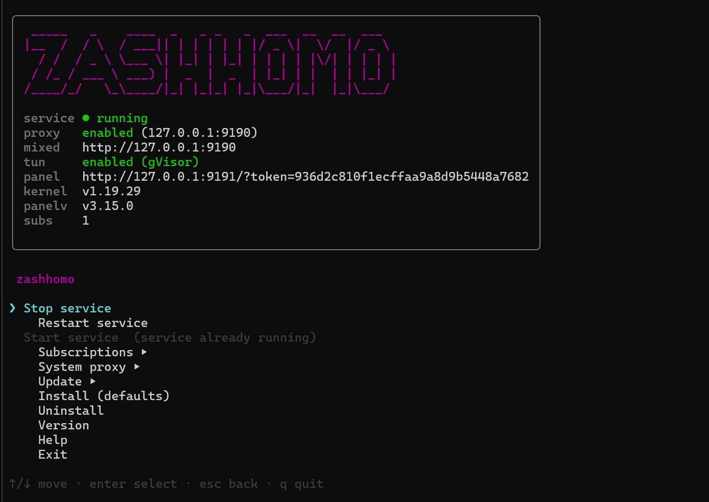
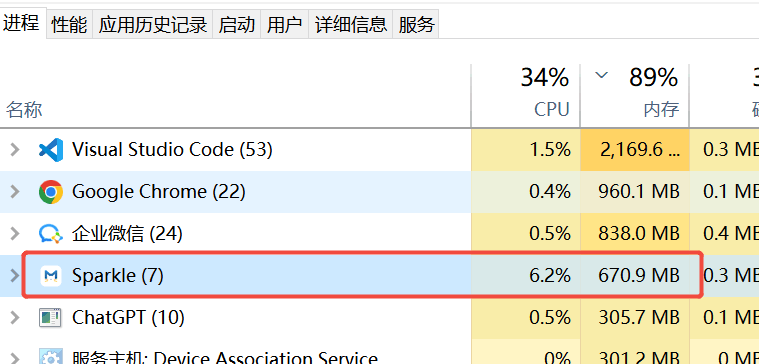
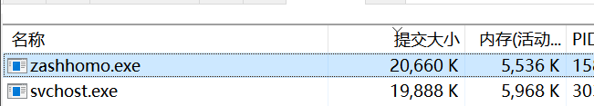
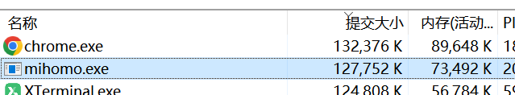

# zashhomo

轻量化的跨平台 [mihomo](https://github.com/MetaCubeX/mihomo) 守护 / 管理程序，内置
[zashboard](https://github.com/Zephyruso/zashboard) Web 面板。一个 <15MB 的静态单二进制，
一行命令即可装好内核 + 面板并常驻守护。



## 特性

- **进程守护**：启动、健康检查（Clash `/version`）、崩溃指数退避自动重启（1s→30s）。
- **自动下载 / 更新内核**：按平台自动选择 mihomo 资产（amd64 默认取 `compatible` 兼容包）。
- **内置面板托管 + 统一密钥**：自带 HTTP 静态站托管 zashboard，并反向代理 Clash REST API。
  同一个自动生成的 secret 既保护 mihomo API（写入内核配置、控制器仅回环），也作为面板访问凭证
  （首次用带 token 的 URL 解锁、之后靠 cookie）。
- **订阅 / 配置管理**：采用 profile 模型，每条订阅独立缓存，同一时刻仅一条生效；支持离线切换、独立刷新间隔与定时更新开关。
- **系统代理一键切换**：`zashhomo system-proxy enable|disable` 跨平台设置系统代理（Windows 注册表、macOS networksetup、Linux GNOME gsettings），状态自动持久化并在服务启停时同步。
- **TUN 模式持久化**：面板中开关 TUN 会自动同步到 `zashhomo.yaml`，跨重启保留。
- **交互式菜单**：`zashhomo -i` 启动 TUI 管理界面（方向键选择），含状态总览、订阅管理、新手引导。
- **系统服务**：通过 [kardianos/service](https://github.com/kardianos/service) 统一封装
  systemd / launchd / Windows 服务，开机自启。

## 内存用量

zashhomo 作为守护进程常驻后台，内存占用极低。以下对比 Sparkle GUI 方案与 zashhomo+mihomo 组合：

| Sparkle（独立 GUI） | zashhomo + mihomo 组合 |
|:---:|:---:|
|  | **zashhomo 守护进程**<br><br><br>**mihomo 内核**<br> |

Sparkle 作为独立 GUI 应用约占用 **700 MB** 内存；而 zashhomo 自身仅约 **5 MB**，加上 mihomo 内核约 **73 MB**，整体更轻量，适合长期后台运行。

## 一行安装

<!-- Linux / macOS（实验性，暂不推荐）：

```sh
curl -fsSL https://raw.githubusercontent.com/LeeShunEE/zashhomo/main/install.sh | bash
```

-->

Windows（PowerShell）：

```powershell
irm https://raw.githubusercontent.com/LeeShunEE/zashhomo/main/install.ps1 | iex
```

> **平台支持说明**：
> - **Windows**：主要支持平台，经过充分测试。
> - **Linux / macOS**：当前为**实验性支持**，可能存在较多 bug 和功能适配不完全（如系统代理、服务管理等）。
>   建议从源码构建试用，问题反馈欢迎提 [Issue](https://github.com/LeeShunEE/zashhomo/issues)。

安装完成后，`zashhomo status` 会打印一个带 token 的面板地址（形如
`http://127.0.0.1:9191/?token=<secret>`），浏览器打开即自动登录为 zashboard 面板。默认仅监听
回环，远程访问见下文「访问与安全」。

## 命令

```text
zashhomo install [--mixed-port N] [--web-port N] [--web-addr ADDR] [--force]
                              下载内核+面板 → 生成默认配置 → 注册系统服务 → 启动
                              （服务已存在时会提示是否替换；--force 直接强制替换）
zashhomo run [--mixed-port N] [--web-port N] [--web-addr ADDR]
                              前台运行守护（服务调用此命令）
zashhomo -i | interactive     交互式管理菜单（方向键选择命令；非终端下回退为逐行输入）
zashhomo service start|stop|restart|status   控制已安装的服务（start/stop/restart 需管理员）
zashhomo status               查看服务状态
zashhomo dashboard            用默认浏览器打开 zashboard 面板（自动带 token 登录）
zashhomo onboard              新手引导：装服务 → 加订阅 → 重启 → 开系统代理 → 开面板
zashhomo system-proxy enable|disable   开启/关闭系统代理（指向 mixed-port）
zashhomo update [--core|--ui|--self|--all]   更新组件
zashhomo sub add <url> [name] 添加订阅并下载到本地缓存
zashhomo sub list             列出订阅及其状态（▸ 标记当前生效的那条）
zashhomo sub show <index>     查看单条订阅的完整信息
zashhomo sub switch <index>   把该订阅切换为生效配置（直接读缓存，无需联网）
zashhomo sub update [index]   刷新指定订阅；省略 index 则刷新全部已启用的
zashhomo sub enable|disable <index>
                              启用/停用某条订阅（停用后不再参与定时更新）
zashhomo sub auto <index> on|off
                              开关该订阅的定时更新
zashhomo sub interval [dur]   查看/设置全局刷新间隔（如 6h、30m）
zashhomo sub interval <index> <dur>
                              为单条订阅设置独立间隔（default 表示跟随全局）
zashhomo sub remove <index>   删除指定订阅（index 见 sub list）
zashhomo sub edit             用编辑器打开配置文件
zashhomo uninstall [--purge]  停服务并移除（--purge 连同数据/配置一起删）
zashhomo version              打印版本
```

`--mixed-port` 指定 mihomo 混合代理端口（默认 9190，启动 mihomo 时生效）；
`--web-port` 只改面板端口、保留监听 host（默认 `127.0.0.1:9191`）；
`--web-addr` 指定完整监听地址（`host:port`），如 `0.0.0.0:9191` 表示对外暴露。
指定后会写入并持久化到 `zashhomo.yaml`。

### 添加订阅

```sh
zashhomo sub add https://example.com/your-subscription
```

订阅采用 **profile 模型**：每条订阅的原始内容下载后存放在 `<数据目录>/subs/<id>.yaml`，
但同一时刻只有**一条**订阅生效——`config.yaml` 完全由这条生效订阅生成（它自己的节点、
策略组和规则），其余订阅在缓存中待命。

```sh
zashhomo sub list             # 看有哪些订阅，▸ 就是当前生效的
zashhomo sub switch 1         # 切到第 1 条（读本地缓存，断网也能切）
zashhomo sub auto 1 off       # 只关掉这条的定时更新
zashhomo sub interval 1 30m   # 只给这条设 30 分钟的刷新间隔
```

停用（`disable`）一条订阅表示它既不能被切换过去、也不参与定时更新；若停用的正好是当前
生效的那条，会自动切换到下一条已启用的订阅。切换和刷新都会自动热重载内核，面板随即生效。

交互式菜单（`zashhomo -i`）的 Subscriptions 页顶部会显示 `Current active:`，并提供
「切换生效订阅」和「逐条管理」两个入口，可用方向键选择。

## 目录布局

| 平台 | 数据目录 | 自身配置 |
| --- | --- | --- |
| Linux/macOS（用户） | `~/.local/share/zashhomo`（或 `$XDG_DATA_HOME/zashhomo`） | `~/.config/zashhomo/zashhomo.yaml`（或 `$XDG_CONFIG_HOME/zashhomo/zashhomo.yaml`） |
| Linux/macOS（root） | `/var/lib/zashhomo` | `/etc/zashhomo/zashhomo.yaml` |
| Windows | `%ProgramData%\zashhomo` | 同数据目录 |

数据目录内含：`bin/`（mihomo 二进制）、`ui/`（zashboard 静态站）、`subs/`（各订阅的原始
文件，按 id 命名）、`config.yaml`（由生效订阅生成的 mihomo 配置）、`zashhomo.log`。

可用环境变量覆盖：
- `ZASHHOMO_DATA` — 数据目录
- `ZASHHOMO_CONFIG_DIR` — 配置目录
- `ZASHHOMO_BIN` — 安装目录（存放 zashhomo 可执行文件）
- `ZASHHOMO_STATE_DIR` — 状态目录（存放 UI 状态如 onboarding 标记）

## 配置（`zashhomo.yaml`）

```yaml
controller_addr: 127.0.0.1:9090   # mihomo external-controller（仅回环）
secret: <自动生成>                 # 同时保护 Clash API 与面板访问
web_addr: 127.0.0.1:9191          # 面板 + API 反代监听地址（默认仅回环）
mixed_port: 9190                  # mihomo 混合代理端口（可用 --mixed-port 改）
system_proxy: false               # 是否自动管理系统代理（由 system-proxy 命令维护）
sub_interval: 12h                 # 全局订阅刷新间隔
active_sub: a1b2c3d4e5f60718      # 当前生效订阅的 id（由 sub switch 维护）
subscriptions:                    # 订阅列表
  - id: a1b2c3d4e5f60718          #   稳定 id，缓存文件名同名（自动生成）
    name: 机场A                    #   显示名
    url: https://example.com/sub  #   订阅地址
    disabled: false               #   true 表示停用：不参与切换与定时更新
    no_auto_update: false         #   true 表示关掉这条的定时更新
    interval: 30m                 #   该订阅独立的刷新间隔（留空则跟随 sub_interval）
    updated_at: 2026-07-24T10:00:00Z  # 上次成功刷新时间（自动记录）
tun:                              # TUN 模式配置（由面板开关同步，自动持久化）
  enable: false
  stack: system
core_version: ""                  # 已装内核版本（自动记录）
ui_version: ""                    # 已装面板版本（自动记录）
```

## 访问与安全

- **单一 secret**：zashhomo 自动生成一个 128-bit secret（存于 `zashhomo.yaml`，0600），同时用作
  mihomo 的 Clash API 密钥与 web 面板的访问凭证，无需手动配置。
- **默认仅回环**：web 面板默认 `127.0.0.1:9191`，mihomo 控制器 `127.0.0.1:9090`，都只对本机可见。
- **打开面板**：`zashhomo status` 给出带 token 的地址 `http://127.0.0.1:9191/?token=<secret>`，
  浏览器打开即自动登录；直接访问则弹出登录页，输入 secret 解锁。API 客户端可用
  `Authorization: Bearer <secret>`。
- **从外部设备访问**：默认回环，外部无法直连。两种方式：
  - **SSH 端口转发（推荐，零暴露）**：`ssh -L 9191:127.0.0.1:9191 user@host`，再在本机浏览器打开
    面板地址。无需改任何配置，secret 不离开本机。
  - **对外监听**：`zashhomo install --web-addr 0.0.0.0:9191`（或把 `zashhomo.yaml` 的 `web_addr`
    改为 `0.0.0.0:9191` 后 `restart`）。此时 secret gate 是对外的唯一防护——务必保管好 secret，
    公网建议前置反代/TLS。之后从外部设备打开 `http://<主机IP>:9191/?token=<secret>`。

## 从源码构建

需要 Go 1.24+：

```sh
CGO_ENABLED=0 go build -trimpath -ldflags "-s -w" -o zashhomo ./cmd/zashhomo
```

交叉编译示例：

```sh
CGO_ENABLED=0 GOOS=linux GOARCH=arm64 go build -trimpath \
  -ldflags "-s -w -X main.version=v0.1.0" -o zashhomo-v0.1.0-linux-arm64 ./cmd/zashhomo
```

## 设计说明

- 依赖标准库 + `gopkg.in/yaml.v3` + `github.com/kardianos/service` + `github.com/charmbracelet/bubbletea`（交互式菜单），无 cobra 等重型 CLI 框架；
  CLI 子命令为手写 dispatch，`CGO_ENABLED=0` 全静态 + `-ldflags "-s -w"` 瘦身。
- 内核与面板默认都只听回环；面板与 Clash API 共用同一 secret，反代统一注入，凭据不外泄。

## 发布

推送 `v*` tag 触发 `.github/workflows/release.yml`：当前仅编译 windows(amd64/arm64)，
产物 `zashhomo-<version>-windows-<arch>.exe` + `SHA256SUMS.txt` 上传至 Releases。
Linux/macOS 平台支持为实验性质，暂不发布预编译包，可从源码构建。
仓库地址：[github.com/LeeShunEE/zashhomo](https://github.com/LeeShunEE/zashhomo)。
